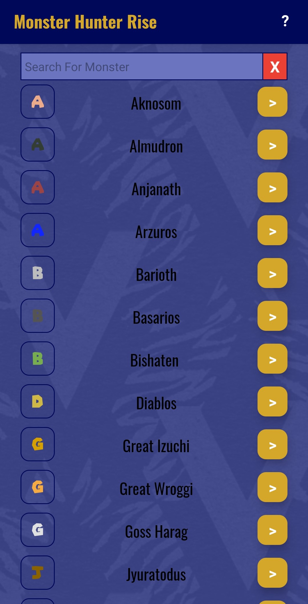
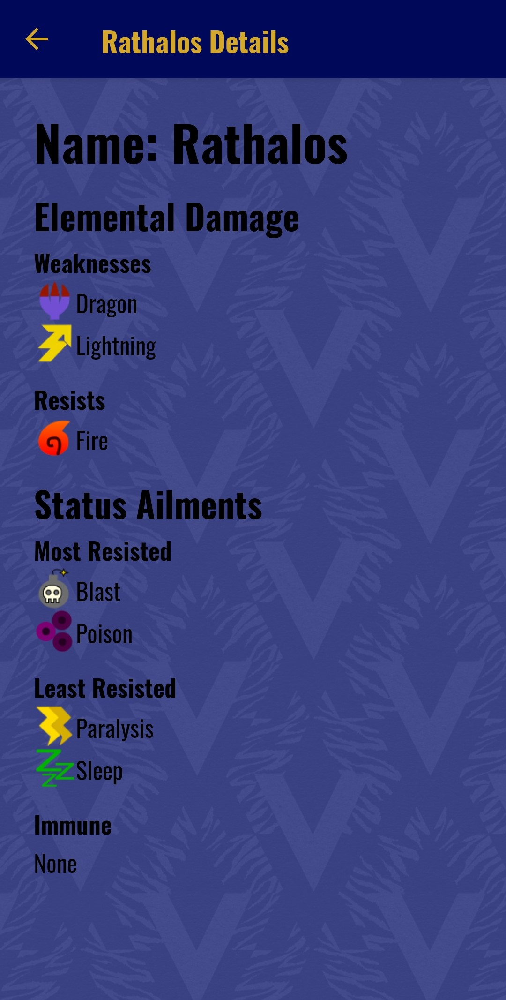

# Elemental Weakness Checker for Monster Hunter Rise
A React Native app to view elemental weaknesses for monsters in Monster Hunter Rise.

Currently published on the Google Play store for download on android devices, [click here](https://play.google.com/store/apps/details?id=io.itch.ztuu.ele_check_mhrise) to download it!

I keep the monster data in this [spreadsheet](https://docs.google.com/spreadsheets/d/1-wHituf-MDc_-AatjYbkgFz9OpqKu3X7N9rF69Aw8do/edit?usp=sharing) which is then exported to csv to create the data file.

## Screenshots
 

## Tools Used
* [Expo](https://docs.expo.io/)
* [React Native Docs](https://reactnative.dev/docs/getting-started)
* [React Navigation Docs](https://reactnavigation.org/docs/getting-started)
* [Super Mario Font](https://www.dafont.com/super-mario-256.font?l[]=10&l[]=1)
* [Background Texture](https://freestocktextures.com/texture/seamless-pattern,1359.html)

### Useful Links
* [React Native Docs](https://reactnative.dev/docs/getting-started)
* [React Navigation Docs](https://reactnavigation.org/docs/getting-started)
* [Expo Docs](https://docs.expo.io/)
* [Expo Google Fonts](https://github.com/expo/google-fonts)
* [Store Listing](https://play.google.com/store/apps/details?id=io.itch.ztuu.ele_check_mhrise)

         
